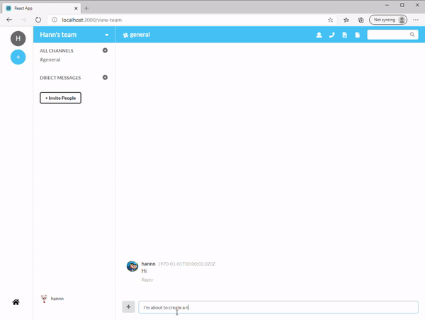

# 💬 GroupMessageApp

<p align="center">

  
</p>
## Basic Overview -
This simple shopping cart prototype shows how React components GraphQL can be used to build a
friendly user experience with instant visual updates and scaleable code in Messaging applications.

#### Features

- Register and Login handled by JWT token
- Create public/private messge group or direct message to anyone i the group
- Additional Message types such as Text, Video, Audio supported
- New Conversations pop up at side bar without page reloads

- Responsive design

## Getting started


## Build/Run

#### Requirements

- Node.js
- Yarn

```javascript
/* First, Install Redis and Start redis service*/
redis-server

/*  Install the needed packages for Frontend*/
cd App/app-client
yarn install

cd App/app-server
yarn install

/* Then start both Node and React */
yarn start


```